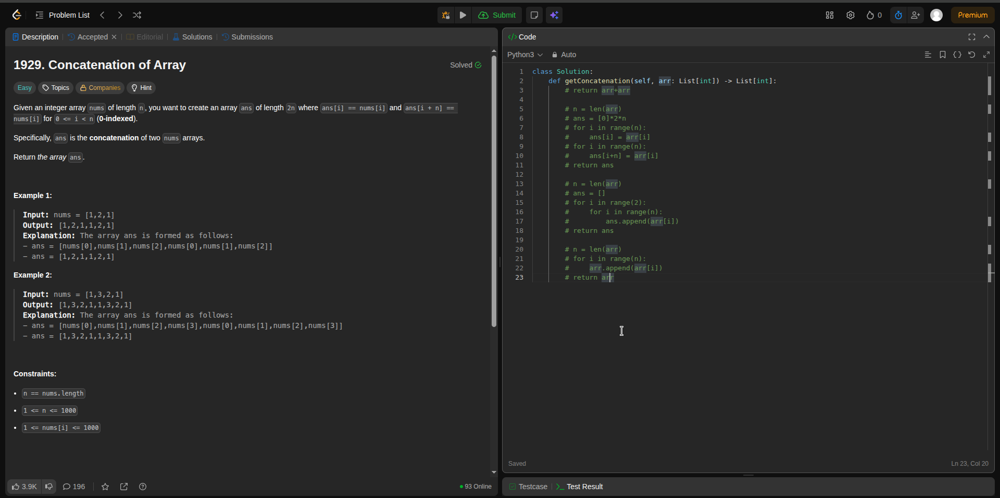

# 🔄 Python Loops & Lists Mastery Guide

## 🎯 Learning Objectives
Master Python's core iteration and data structures - the foundation of data engineering workflows.

> 💡 **Why This Matters:** Loops and lists are the building blocks of data processing, ETL pipelines, and automated data workflows.

---

# 🔄 PART 1: LOOPS & FLOW CONTROL

## ⏰ While Loops - The Conditional Iterator

### 🎯 **Core Concept**
Executes code repeatedly as long as a condition remains `True`.

### 📋 **Structure & Behavior**
```python
while condition:
    # code block
    # must modify condition to avoid infinite loop
```

**Execution Flow:**
1. Check condition before each iteration
2. If `True` → execute code block
3. If `False` → terminate loop

### ⚠️ **Infinite Loop Prevention**
```python
# ❌ Dangerous: Infinite loop
while True:
    print("This runs forever!")

# ✅ Safe: Controlled loop
count = 0
while count < 5:
    print(f"Count: {count}")
    count += 1  # Critical: modify the condition variable
```

**Emergency Stop:** Press `CTRL-C` to terminate infinite loops.

---

## 🔢 For Loops & Range - The Precise Iterator

### 🎯 **Core Concept**
Executes code a specific number of times using the `range()` function.

### 📋 **Basic Structure**
```python
for variable in range(stop):
    # code block
```

### 🔧 **Range Function Variations**
| Syntax | Output | Use Case |
|--------|--------|----------|
| `range(5)` | 0, 1, 2, 3, 4 | Simple counting |
| `range(1, 6)` | 1, 2, 3, 4, 5 | Custom start/stop |
| `range(0, 10, 2)` | 0, 2, 4, 6, 8 | Step increments |
| `range(5, -1, -1)` | 5, 4, 3, 2, 1, 0 | Countdown |

### 💻 **Practical Examples**
```python
# Basic counting
for i in range(5):
    print(f"Iteration {i}")

# Custom range with step
for num in range(10, 0, -2):
    print(f"Countdown: {num}")

# Processing data indices
data = ['a', 'b', 'c', 'd']
for i in range(len(data)):
    print(f"Index {i}: {data[i]}")
```

---

## 🎮 Loop Control Statements

### 🛑 **Break Statement**
**Purpose:** Immediately exits the loop entirely.

```python
# Find first even number
numbers = [1, 3, 7, 8, 9, 12]
for num in numbers:
    if num % 2 == 0:
        print(f"First even number: {num}")
        break  # Exit loop immediately
```

### ⏭️ **Continue Statement**
**Purpose:** Skips current iteration, jumps to next.

```python
# Process only positive numbers
numbers = [-2, 5, -1, 8, 0, 3]
for num in numbers:
    if num <= 0:
        continue  # Skip negative/zero numbers
    print(f"Processing: {num}")
```

---

## 📦 Module Importing & Program Control

### 📚 **Standard Library Access**
```python
import random
import sys
import math

# Usage examples
random_num = random.randint(1, 10)
math.sqrt(16)
sys.exit()  # Terminate program
```

### ⚠️ **Naming Conflicts**
```python
# ❌ Don't name files same as standard modules
# Avoid: random.py, math.py, sys.py

# ✅ Use descriptive, unique names
# Good: data_processor.py, user_manager.py
```

### 🚪 **Program Termination**
```python
import sys

user_input = input("Continue? (y/n): ")
if user_input.lower() == 'n':
    print("Goodbye!")
    sys.exit()  # Clean program termination
```

---

## ✅ Truthy & Falsey Values

### 📊 **Value Categories**
| Category | Values | Boolean Equivalent |
|----------|--------|-------------------|
| **Falsey** | `0`, `0.0`, `''`, `None`, `[]` | `False` |
| **Truthy** | `1`, `'hello'`, `[1,2,3]`, `100` | `True` |

### 💻 **Practical Applications**
```python
# Input validation
name = input("Enter your name: ")
while not name:  # Continues if name is empty string
    name = input("Name cannot be empty. Try again: ")

# List processing
data = []
while data:  # Only runs if list has items
    process_item(data.pop())
```

---

# 📋 PART 2: LISTS FUNDAMENTALS

## 🗂️ List Basics & Syntax

### 🎯 **Definition**
A **mutable, ordered sequence** of values that can store any data type.

### 📋 **Core Syntax**
```python
# Creation
fruits = ['apple', 'banana', 'cherry']
mixed = ['text', 42, 3.14, True]
empty = []

# Access patterns
fruits[0]    # First item: 'apple'
fruits[-1]   # Last item: 'cherry'
fruits[1:3]  # Slice: ['banana', 'cherry']
```

### 🔢 **Indexing System**
| Index | Positive | Negative | Value |
|-------|----------|----------|-------|
| First | `[0]` | `[-3]` | 'apple' |
| Second | `[1]` | `[-2]` | 'banana' |
| Last | `[2]` | `[-1]` | 'cherry' |

### 📏 **Slicing Operations**
```python
data = [0, 1, 2, 3, 4, 5]

# Slicing patterns
data[1:4]    # [1, 2, 3] - includes start, excludes stop
data[:3]     # [0, 1, 2] - from beginning to index 3
data[2:]     # [2, 3, 4, 5] - from index 2 to end
data[::2]    # [0, 2, 4] - every second element
```

---

## 🔧 List Operations & Manipulation

### ➕ **Concatenation & Replication**
```python
list1 = [1, 2, 3]
list2 = [4, 5, 6]

# Combine lists
combined = list1 + list2  # [1, 2, 3, 4, 5, 6]

# Repeat lists
repeated = [0] * 5  # [0, 0, 0, 0, 0]
```

### ✏️ **Modification Operations**
```python
fruits = ['apple', 'banana', 'cherry']

# Direct assignment
fruits[1] = 'blueberry'  # ['apple', 'blueberry', 'cherry']

# Deletion
del fruits[0]  # ['blueberry', 'cherry']
```

### 🔍 **Membership Testing**
```python
fruits = ['apple', 'banana', 'cherry']

# Check existence
if 'apple' in fruits:
    print("Apple found!")

if 'grape' not in fruits:
    print("No grapes available")
```

---

## 🔄 List Iteration Patterns

### 🎯 **Value Iteration**
```python
fruits = ['apple', 'banana', 'cherry']

# Iterate through values
for fruit in fruits:
    print(f"Processing: {fruit}")
```

### 📍 **Index Iteration**
```python
# When you need indices
for i in range(len(fruits)):
    print(f"Index {i}: {fruits[i]}")
```

### 🔢 **Enumerate Pattern**
```python
# Get both index and value
for index, fruit in enumerate(fruits):
    print(f"{index}: {fruit}")
```

### 📊 **Multiple Assignment**
```python
# Unpack list to variables
coordinates = [10, 20, 30]
x, y, z = coordinates  # x=10, y=20, z=30

# Must match list length exactly
```

---

# 📋 PART 3: ADVANCED LIST OPERATIONS

## 🛠️ Essential List Methods

### 🔍 **Finding Elements**
```python
numbers = [10, 20, 30, 20, 40]

# Find first occurrence
index = numbers.index(20)  # Returns 1
# Raises ValueError if not found
```

### ➕ **Adding Elements**
```python
fruits = ['apple', 'banana']

# Add to end
fruits.append('cherry')  # ['apple', 'banana', 'cherry']

# Insert at specific position
fruits.insert(1, 'blueberry')  # ['apple', 'blueberry', 'banana', 'cherry']
```

### ➖ **Removing Elements**
```python
fruits = ['apple', 'banana', 'cherry', 'banana']

# Remove first occurrence
fruits.remove('banana')  # ['apple', 'cherry', 'banana']
# Raises ValueError if not found

# Remove by index
del fruits[0]  # ['cherry', 'banana']
```

### 📊 **Sorting & Ordering**
```python
numbers = [3, 1, 4, 1, 5]
names = ['Charlie', 'alice', 'Bob']

# Sort in place
numbers.sort()  # [1, 1, 3, 4, 5]
numbers.sort(reverse=True)  # [5, 4, 3, 1, 1]

# Case-insensitive sorting
names.sort(key=str.lower)  # ['alice', 'Bob', 'Charlie']

# Reverse order
numbers.reverse()  # Flips current order
```

---

## 🔄 Sequence Types Comparison

### 📊 **Mutability Matrix**
| Type | Mutable | Syntax | Use Case |
|------|---------|--------|----------|
| **List** | ✅ Yes | `[1, 2, 3]` | Dynamic data |
| **Tuple** | ❌ No | `(1, 2, 3)` | Fixed data |
| **String** | ❌ No | `"hello"` | Text data |

### 🔄 **Type Conversions**
```python
# Convert between types
my_list = [1, 2, 3]
my_tuple = tuple(my_list)    # (1, 2, 3)
my_string = str(my_list)     # "[1, 2, 3]"

# Back to list
new_list = list(my_tuple)    # [1, 2, 3]
```

### 📦 **Tuple Specifics**
```python
# Single item tuple (note the comma!)
single = (42,)  # Without comma: just parentheses

# Tuple unpacking
point = (10, 20)
x, y = point  # x=10, y=20
```

---

## 🧠 Memory & References (Critical Concept)

### 🔗 **Reference Behavior**
```python
# Variables store references, not values
list1 = [1, 2, 3]
list2 = list1  # Copies reference, not data

list2.append(4)
print(list1)  # [1, 2, 3, 4] - Both lists affected!
```

### 📋 **Function Parameter Passing**
```python
def modify_list(data):
    data.append('modified')  # Affects original list

my_list = [1, 2, 3]
modify_list(my_list)
print(my_list)  # [1, 2, 3, 'modified']
```

### 📄 **Creating True Copies**
```python
import copy

original = [1, 2, [3, 4]]

# Shallow copy
shallow = copy.copy(original)
shallow = original.copy()  # Alternative method
shallow = original[:]      # Slice method

# Deep copy (for nested structures)
deep = copy.deepcopy(original)
```

---

## 🎲 Random Operations & Utilities

### 🎯 **Random Module Integration**
```python
import random

fruits = ['apple', 'banana', 'cherry', 'date']

# Random selection
chosen = random.choice(fruits)  # Returns random item

# Shuffle in place
random.shuffle(fruits)  # Reorders list randomly
print(fruits)  # Random order each time
```

### ⚡ **Performance Optimizations**
```python
# Short-circuit evaluation
data = []
if len(data) > 0 and data[0] == 'target':
    # Safe: won't access data[0] if list is empty
    process_data()

# Augmented assignment (faster)
numbers = [1, 2, 3]
numbers += [4, 5]  # Faster than numbers = numbers + [4, 5]
numbers *= 2       # [1, 2, 3, 4, 5, 1, 2, 3, 4, 5]
```

---

## 🎯 Real-World Applications

### 📊 **Data Processing Pipeline**
```python
# ETL-style data processing
raw_data = ['  Alice  ', 'BOB', '  charlie  ', '']

# Clean and process
cleaned_data = []
for item in raw_data:
    cleaned = item.strip().title()
    if cleaned:  # Skip empty strings
        cleaned_data.append(cleaned)

print(cleaned_data)  # ['Alice', 'Bob', 'Charlie']
```

### 🔄 **Batch Processing Pattern**
```python
def process_batch(items, batch_size=3):
    for i in range(0, len(items), batch_size):
        batch = items[i:i + batch_size]
        print(f"Processing batch: {batch}")

data = list(range(10))
process_batch(data)  # Processes in chunks of 3
```

---

## 🎯 Key Takeaways

### 🔄 **Loops Mastery**
- ✅ `while` loops for condition-based iteration
- ✅ `for` loops with `range()` for precise control
- ✅ `break` and `continue` for flow control
- ✅ Import modules for extended functionality
- ✅ Understand truthy/falsey values

### 📋 **Lists Mastery**
- ✅ Lists are mutable, ordered sequences
- ✅ Zero-based indexing with negative index support
- ✅ Slicing creates new list subsets
- ✅ Rich set of methods for manipulation
- ✅ Reference behavior affects copying and functions

### 🧠 **Advanced Concepts**
- ✅ Memory references vs. value copying
- ✅ Sequence type conversions
- ✅ Performance optimization techniques
- ✅ Real-world data processing patterns

---

## 🚀 Next Challenge

**Task: Enhanced Grade Processor**
```python
# Input: Mixed data types and edge cases
grades = [85, '92', 78, None, '88', 95, 'A+', 72]

# Requirements:
# 1. Clean and validate data
# 2. Convert strings to integers where possible
# 3. Handle invalid entries gracefully
# 4. Calculate statistics (average, min, max)
# 5. Categorize grades (A, B, C, D, F)
```

---

## 🏆 LeetCode Challenge: Array Concatenation

### 📋 **Problem: Concatenation of Array**
**Difficulty:** Easy | **Topic:** Arrays & Lists

**Problem Statement:** Given an integer array `nums` of length `n`, create an array `ans` of length `2n` where `ans[i] == nums[i]` and `ans[i + n] == nums[i]` for `0 <= i < n`.

### 💻 **Solution Approach**
```python
def getConcatenation(nums):
    return nums + nums  # Simple concatenation
```

### 📊 **Visual Solution**


**Key Insights:**
- ✅ Demonstrates list concatenation with `+` operator
- ✅ Shows practical application of array manipulation
- ✅ Perfect example of Python's elegant syntax for common operations

---