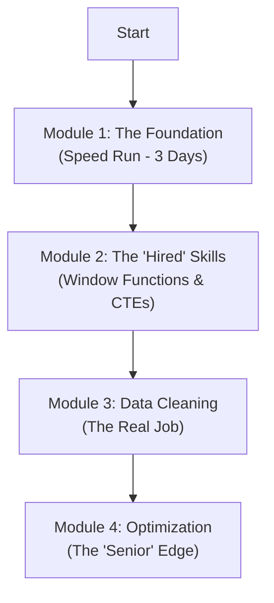

# 🏛️ The Junior DE SQL Syllabus (India 2026 Edition)

> [!NOTE]
> This roadmap is designed for speed and practical engineering. Focus on the "why" and "how" of execution order and performance.

> 🎯 **Follow the Data Engineer Roadmap** - Progress through each module systematically, but **do at your pace**. Quality understanding beats speed.



---

## ⚡ Module 1: The Foundation (Speed Run)
**Target:** Clear this in **3 Days**. You cannot fail these.

> 💡 **Learning Approach:** These are non-negotiable fundamentals. Master them before advancing.

### ✅ **Completion Checklist**
- [ ] Execution Order (Critical for debugging)
- [ ] Filtering (`WHERE` vs `HAVING`) - #1 Interview Topic
- [ ] Set Operations (UNION, INTERSECT, EXCEPT)
- [ ] Joins (Inner, Left, Right, Full, Cross, Self)

### 🔍 **1. SQL Execution Order (Critical)**
**Why This Matters:** Understanding execution order is essential for debugging complex queries and optimizing performance.

```sql
-- Logical Processing Order (Memory This!)
1. FROM / JOIN     -- Identify data sources
2. WHERE          -- Filter individual rows
3. GROUP BY       -- Group filtered data
4. HAVING         -- Filter grouped results
5. SELECT         -- Choose output columns
6. ORDER BY       -- Sort final results
7. LIMIT/TOP      -- Restrict result count
```

**🎯 Pro Tip:** When debugging, trace through this order to understand why your query behaves unexpectedly.

### ⚖️ **2. Filtering: WHERE vs HAVING**
> [!IMPORTANT]
> This is the **#1 Interview Question** for junior data engineers.

| Aspect | WHERE | HAVING |
|--------|-------|--------|
| **Applied To** | Individual rows | Aggregated groups |
| **Execution Timing** | Before GROUP BY | After GROUP BY |
| **Can Use Aggregates?** | ❌ No (`SUM`, `COUNT`, etc.) | ✅ Yes |
| **Performance** | ✅ Faster (filters early) | ⚠️ Slower (filters late) |
| **Use Case** | Row-level filtering | Group-level filtering |

**Example:**
```sql
-- ✅ Correct: WHERE for row filtering
SELECT department, COUNT(*) as emp_count
FROM employees 
WHERE salary > 50000  -- Filter individuals first
GROUP BY department
HAVING COUNT(*) > 5;  -- Then filter groups
```

### 🔗 **3. Set Operations & Joins**

#### **Set Operations**
| Operation | Purpose | Duplicates | Performance |
|-----------|---------|------------|-------------|
| `UNION` | Combine + Remove duplicates | ❌ Removed | Slower |
| `UNION ALL` | Combine + Keep duplicates | ✅ Kept | ⚡ Faster |
| `INTERSECT` | Common records only | ❌ Removed | Moderate |
| `EXCEPT` | Records in first, not second | ❌ Removed | Moderate |

#### **Essential Joins**
- **INNER JOIN:** Only matching records
- **LEFT JOIN:** All from left + matching from right
- **RIGHT JOIN:** All from right + matching from left  
- **FULL JOIN:** All records from both tables

#### **Data Engineer Specials**
- **CROSS JOIN:** Cartesian product for combinations
- **SELF JOIN:** Table joined with itself (hierarchies, comparisons)

---

## 💼 Module 2: The "Hired" Skills (Window Functions & CTEs)
**Target:** Spend **50% of your time here**. This is the interview filter.

> 🎯 **Career Impact:** These skills separate junior from mid-level data engineers. Master these to stand out.

### ✅ **Mastery Checklist**
- [ ] Ranking Functions (ROW_NUMBER, RANK, DENSE_RANK)
- [ ] Time Series Analysis (`LEAD`/`LAG`)
- [ ] Running Totals & Moving Averages
- [ ] CTEs & Recursive Queries

### 🏆 **1. Ranking Functions**
**Critical:** Know exactly how each function handles ties.

```sql
SELECT
    employee_name,
    salary,
    ROW_NUMBER() OVER (ORDER BY salary DESC) as row_num,  -- 1,2,3,4 (unique)
    RANK() OVER (ORDER BY salary DESC) as rank,           -- 1,2,2,4 (skips)
    DENSE_RANK() OVER (ORDER BY salary DESC) as dense     -- 1,2,2,3 (no skip)
FROM employees;
```

**Use Cases:**
- **ROW_NUMBER():** Pagination, unique identifiers
- **RANK():** Competition rankings (Olympic-style)
- **DENSE_RANK():** Academic grades, performance tiers

### 📈 **2. Time Series & Running Totals**

#### **Lead/Lag for Growth Analysis**
```sql
SELECT 
    month,
    revenue,
    LAG(revenue) OVER (ORDER BY month) as prev_month,
    revenue - LAG(revenue) OVER (ORDER BY month) as growth
FROM monthly_sales;
```

#### **Running Totals & Moving Averages**
```sql
SELECT 
    date,
    daily_sales,
    SUM(daily_sales) OVER (ORDER BY date) as running_total,
    AVG(daily_sales) OVER (ORDER BY date ROWS BETWEEN 6 PRECEDING AND CURRENT ROW) as week_avg
FROM sales;
```

### 🔧 **3. CTEs (Common Table Expressions)**
**Purpose:** Clean up complex subqueries, improve readability.

```sql
WITH high_performers AS (
    SELECT employee_id, name, performance_score
    FROM employees 
    WHERE performance_score > 8.5
),
department_stats AS (
    SELECT department, AVG(salary) as avg_salary
    FROM employees
    GROUP BY department
)
SELECT hp.name, ds.avg_salary
FROM high_performers hp
JOIN department_stats ds ON hp.department = ds.department;
```

> [!TIP]
> **Recursive CTEs** excel at hierarchical data (org charts, category trees) and generating sequences.

---

## 🧹 Module 3: Data Cleaning & Transformation (The Real Job)
**Target:** Practical engineering skills for production pipelines.

> 💼 **Reality Check:** 80% of a data engineer's time is spent cleaning and transforming data. These skills are your daily bread.

### 🛠️ **Essential Function Categories**

| Category | Functions | Real-World Use Case | Example |
|----------|-----------|-------------------|----------|
| **Null Handling** | `COALESCE`, `NULLIF`, `ISNULL` | Default values, data quality | `COALESCE(phone, 'N/A')` |
| **Type Casting** | `CAST`, `::`, `CONVERT` | API data normalization | `CAST(date_string AS DATE)` |
| **String Operations** | `SUBSTRING`, `SPLIT_PART`, `REGEXP` | Log parsing, data extraction | `SPLIT_PART(email, '@', 2)` |
| **Date/Time** | `DATE_TRUNC`, `EXTRACT`, `INTERVAL` | Time-based aggregations | `DATE_TRUNC('month', order_date)` |
| **Conditional Logic** | `CASE WHEN`, `IIF` | Business rule implementation | Status categorization |

### 🎯 **Production-Ready Patterns**

#### **Data Quality Checks**
```sql
SELECT 
    COUNT(*) as total_records,
    COUNT(email) as non_null_emails,
    COUNT(CASE WHEN email LIKE '%@%' THEN 1 END) as valid_emails,
    ROUND(100.0 * COUNT(email) / COUNT(*), 2) as email_completeness
FROM users;
```

#### **Standardization Pipeline**
```sql
WITH cleaned_data AS (
    SELECT 
        UPPER(TRIM(country)) as country,
        COALESCE(phone, 'Unknown') as phone,
        CASE 
            WHEN age BETWEEN 0 AND 120 THEN age 
            ELSE NULL 
        END as validated_age
    FROM raw_customer_data
)
SELECT * FROM cleaned_data WHERE country IS NOT NULL;
```

---

## 🚀 Module 4: Performance & Optimization (The "Senior" Edge)
**Target:** Impress hiring managers and optimize production systems.

> ⚡ **Senior Mindset:** Anyone can write SQL that works. Seniors write SQL that works **fast** and **scales**.

### 🎯 **Core Optimization Areas**

#### **1. Indexing Strategy**
**Concept:** B-Tree indexes accelerate data retrieval but slow down writes.

```sql
-- Create strategic indexes
CREATE INDEX idx_orders_customer_date ON orders(customer_id, order_date);
CREATE INDEX idx_products_category ON products(category) WHERE active = true;
```

> [!WARNING]
> **When NOT to Index:**
> - Small tables (< 1000 rows)
> - High-write, low-read tables
> - Low-cardinality columns (gender, boolean)
> - Frequently updated columns

#### **2. Query Execution Plans**
**Master This:** Reading `EXPLAIN ANALYZE` output.

```sql
EXPLAIN ANALYZE
SELECT c.name, COUNT(o.id)
FROM customers c
LEFT JOIN orders o ON c.id = o.customer_id
WHERE c.created_date > '2023-01-01'
GROUP BY c.name;
```

**Optimization Targets:**
- ✅ **Seek:** Index Scan, Nested Loop (small datasets)
- ❌ **Avoid:** Sequential Scan (large tables), Hash Join (massive datasets)

#### **3. Partitioning Strategies**
**Use Cases:** Time-series data, geographical data, large fact tables.

```sql
-- Range partitioning by date
CREATE TABLE sales_2024 PARTITION OF sales
FOR VALUES FROM ('2024-01-01') TO ('2025-01-01');
```

### 📊 **Performance Monitoring**

#### **Query Performance Metrics**
```sql
-- Identify slow queries
SELECT 
    query,
    calls,
    total_time,
    mean_time,
    rows
FROM pg_stat_statements 
ORDER BY mean_time DESC
LIMIT 10;
```

#### **Index Usage Analysis**
```sql
-- Find unused indexes
SELECT 
    schemaname,
    tablename,
    indexname,
    idx_scan,
    idx_tup_read
FROM pg_stat_user_indexes 
WHERE idx_scan = 0;
```

---

## 🗑️ What to Deprioritize
*Strategic focus for junior data engineers*

### ⏸️ **Lower Priority Topics**
1. **Triggers & Stored Procedures** - Modern data engineering uses Python/Airflow for business logic
2. **Database Administration** - Focus on querying and analysis first
3. **Advanced Security Features** - Learn after mastering core SQL skills
4. **Legacy SQL Dialects** - Prioritize PostgreSQL, BigQuery, Snowflake

### 🤖 **AI Tools Approach**
> [!CAUTION]
> Learn SQL fundamentals **first**, then use AI as an accelerator. AI is a crutch until you master the syntax and logic.

**Recommended Progression:**
1. Master Modules 1-2 manually
2. Use AI for Module 3-4 exploration
3. Always understand AI-generated code before using

---

## 🎯 Success Metrics

### ✅ **Module Completion Criteria**
- **Module 1:** Can write complex joins and explain execution order
- **Module 2:** Comfortable with window functions and CTEs
- **Module 3:** Can clean and transform messy real-world data
- **Module 4:** Can identify and fix performance bottlenecks

### 🏆 **Career Readiness Indicators**
- Solve 80% of SQL interview questions without hints
- Optimize slow queries using execution plans
- Design efficient data models for business requirements
- Explain trade-offs between different SQL approaches

---

*Follow the roadmap, master each module, and build your data engineering career systematically! 🚀*