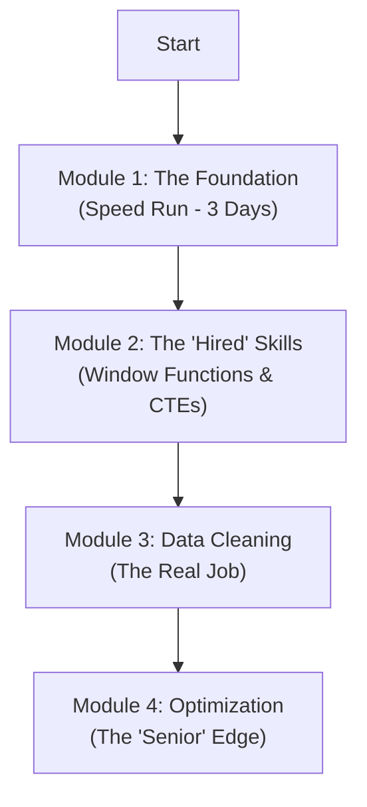

# 🏛️ The Junior DE SQL Syllabus (India 2026 Edition)

> [!NOTE]
> This roadmap is designed for speed and practical engineering. Focus on the "why" and "how" of execution order and performance.



---

## ⚡ Module 1: The Foundation (Speed Run)
**Target:** Clear this in **3 Days**. You cannot fail these.

### Checklist
- [ ] Execution Order
- [ ] Filtering (`WHERE` vs `HAVING`)
- [ ] Set Operations
- [ ] Joins (including Cross & Self)

### 1. Execution Order (Critical)
Understand why `FROM` runs before `SELECT`. This is critical for debugging.

```sql
-- Logical Processing Order
1. FROM / JOIN
2. WHERE
3. GROUP BY
4. HAVING
5. SELECT
6. ORDER BY
7. LIMIT
```

### 2. Filtering: WHERE vs HAVING
> [!IMPORTANT]
> This is the #1 Interview Question.

| Feature | WHERE | HAVING |
| :--- | :--- | :--- |
| **Applied To** | Individual Rows | Groups (Aggregated Data) |
| **Timing** | Before Grouping | After Grouping |
| **Can use Aggregates?** | ❌ No | ✅ Yes |

### 3. Set Operations & Joins
*   **Set Ops:** `UNION` (Distinct) vs `UNION ALL` (Duplicates allowed - Faster).
*   **Joins:** Inner, Left, Right, Full.
*   **DE Specials:**
    *   **Cross Join:** Generating combinations.
    *   **Self Join:** Employee-Manager hierarchy.

---

## 💼 Module 2: The "Hired" Skills (Window Functions & CTEs)
**Target:** Spend **50% of your time here**. This is the interview filter.

### Checklist
- [ ] Ranking Functions
- [ ] Time Series (`LEAD`/`LAG`)
- [ ] Running Totals
- [ ] CTEs & Recursion

### 1. Ranking Functions
Know exactly how they handle ties.

```sql
SELECT
    val,
    ROW_NUMBER() OVER (ORDER BY val) as row_num, -- 1, 2, 3, 4
    RANK() OVER (ORDER BY val) as rank,          -- 1, 2, 2, 4 (Skips)
    DENSE_RANK() OVER (ORDER BY val) as dense    -- 1, 2, 2, 3 (No Skip)
FROM numbers;
```

### 2. Time Series & Running Totals
*   **Growth:** `LEAD()` and `LAG()` for Year-over-Year calculations.
*   **Totals:** `SUM(sale) OVER (ORDER BY date)` and `ROWS BETWEEN`.

### 3. CTEs (Common Table Expressions)
Use `WITH` clauses to clean up messy subqueries.

> [!TIP]
> **Recursive CTEs** are great for generating date ranges or traversing hierarchies (like Org Charts).

---

## 🧹 Module 3: Data Cleaning & Transformation (The Real Job)
**Target:** Practical Engineering & Pipeline Reliability.

| Category | Functions | Use Case |
| :--- | :--- | :--- |
| **Null Handling** | `COALESCE`, `NULLIF` | Default values, avoiding divide-by-zero. |
| **Type Casting** | `CAST`, `::` | String to Date, Int to Float. |
| **Strings** | `SUBSTRING`, `SPLIT_PART`, `REGEX` | Parsing messy logs or user agents. |
| **Date/Time** | `DATE_TRUNC`, `EXTRACT` | Aggregating by month/week. Timezone conversion. |

---

## 🚀 Module 4: Performance & Optimization (The "Senior" Edge)
**Target:** Impress the Hiring Manager.

*   **Indexing:** How B-Tree indexes work.
    > [!WARNING]
    > Know when *not* to index (e.g., small tables or low-cardinality columns).
*   **Partitioning:** Splitting large tables for speed (by Date or Region).
*   **Query Plans:** Reading `EXPLAIN ANALYZE`.
    *   Target: **Index Scan**
    *   Avoid: **Seq Scan** (on large tables)

---

## 🗑️ What to Deprioritize
*From the Video Recommendations*

1.  **Triggers & Stored Procedures:** *Low Priority.* Modern DEs use Python/Airflow for logic, not DB triggers.
2.  **Views:** *Medium Priority.* Good to know, but moving data to a "Presentation Layer" table is often preferred for performance.
3.  **AI Tools:** *Skip.* Learn the logic first. AI is a crutch until you master the syntax.
